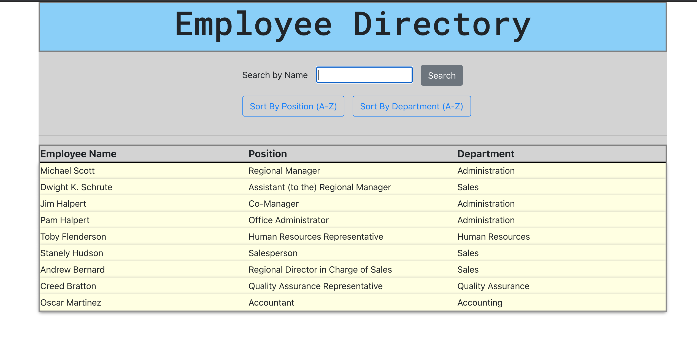
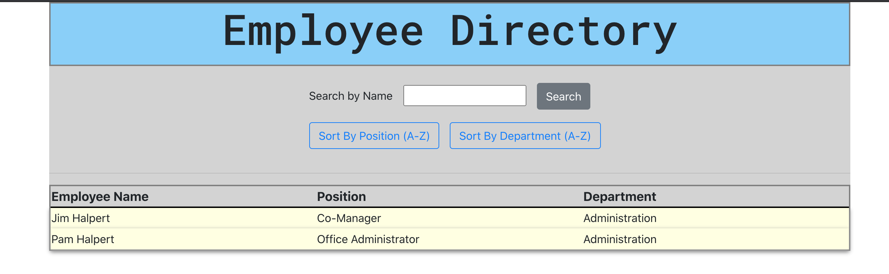
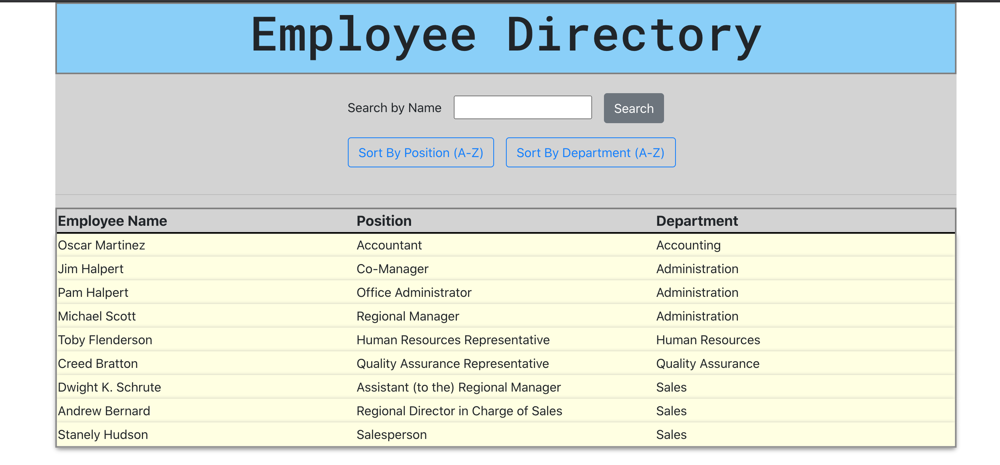

# React Employee Directory

### **by Roger Pouncey** 

An employee directory built with React.  Users are able to filter employees by name, and sort employees by position and department.

Email: rpounceyjr@gmail.com

## **Table of Contents** 

#### i. [Installation](#installation)

#### ii. [Usage](#usage)

#### iii. [Contributing](#contributing)

#### iv. [Tests](#tests)

#### v. [Questions](#questions)

## **Installation** 
 
                $ npm i

## **Usage** 

This employee directory app uses React to render the front end of the application.  Multiple components are used to create a table.  The user may use the search bar to filter employees by name.

The user may also sort employees by two different fields: position and department.  Both sort buttons sort the associated fields alphabetically in ascending order.   

## **Contributing** 

This project was created by Roger Pouncey.  Improvements can be made to the app by making a pull request on GitHub.

## **Tests** 

No tests were performed on this app.

## **Questions** 

Questions about this app can be addressed to Roger Pouncey, either through GitHub or via the above email address.